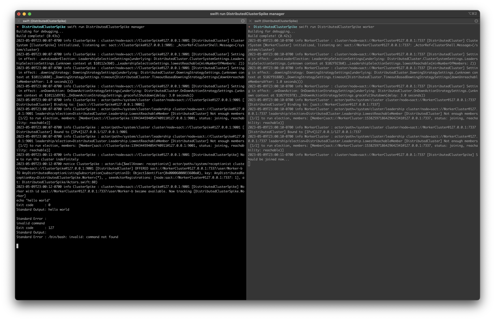

# Distributed Cluster Spike

Sample code (a spike) learning how to use Distributed Actors in swift.

For another project, I had the realization that Distributed Actors would be a near-perfect potential solution to a problem of dispatching work to workers. Problem is, I don't have any experience with Distributed Actors. This repository serves as a playground for me to gain experience with Distributed Actors and learn how to use them for somewhat trivial problems.

This attempts to answer the following:

- [x] Creating Clusters
- [x] Joining Workers to a pool
- [x] Dispatching commands to workers
- [ ] Handling workers/other clusters withdrawing/terminating.
- [ ] Queueing work.
- [ ] Streaming work progress.
- [ ] Securing this cluster (i.e. TLS)
- [ ] Creating clusters where workers are behind NATs (i.e. workers can directly reach the worker pool, but not the other way around). Will this Just Work?
- [ ] What other kinds of protocols are available? What are the trade-offs of one protocol vs. another?
- [ ] Testing.
- [ ] Observability.
- [x] Logging

## What This Program Actually Does

This program creates a very simple way to run bash commands on one of the worker nodes. There is no containerization/virtualization done for these commands whatsoever. The only attempt at being "clean" is the Executor creates a new folder in /tmp for the command to run in. When the command finishes, that folder is deleted. I cannot stress enough that this is really insecure and should not be used in a production system. Even once TLS is added to this, you should not allow arbitrary code to execute in a non-secured environment.

That said, this works by you typing the bash script into standard input. If there is a worker available to run the command, then the command is submitted to the worker and executed using `/bin/bash -c`. For example, if you type `echo 'hello world'`, then the worker would effectively run `/bin/bash -c echo 'hello world'`. The manager program then outputs the exit code, and contents of standand input and standard output. Currently, this doesn't allow for interactivity, though that could be something I look into in the future.

You can create the worker pool/command input/output process by invoking `swift run DistributedClusterSpike manager`. You can create a worker by invoking `swift run DistributedClusterSpike worker`. Both the `manager` and `worker` subcommands take `--host` and `--port` arguments, which are used to specify the host/port that the workerpool/manager cluster will bind to. The worker cluster will always bind to default values.

This does not explore automatic discovery of clusters.

## Learnings

The entire point of spikes is what you learn from them. As such, here is what I've learned:

### Creating Clusters

See [DistributedClusterSpike.swift](Sources/DistributedClusterSpike.swift).

You need to import the `Distributed` module (which ships with Swift and provides the Distributed Actors runtime/library), as well as the `DistributedCluster` module (which ships as part of the [swift-distributed-actors](https://github.com/apple/swift-distributed-actors) package). `DistributedCluster` is where the `ClusterSystem` APIs come from.

You initialize the cluster first, then pass it in to the distributed actor (the `WorkerPool` and `Worker` types in this repository). Each process will need their own cluster. For talking to a known, central cluster, you'll need to call `clusterSystem.cluster.joined(endpoint:within:)` with the host/port/protocol of the managing cluster.

Once you have that set up, have your distributed actors join the cluster. You do that by passing the cluster in to the `.init` of the actor (this is required by the `DistributedActor` protocol, which all distributed actors conform to by definition).

### Joining Workers to a Pool

See [Actors.swift](Sources/Actors.swift).

`swift-distributed-actors` provides an existing `WorkerPool` class and `Worker` protocols. Those are SLIGHTLY too basic for what I'm aiming to do. I want to be able to filter workers (I'd eventually like to specify that a given task will only go to a worker with a given tag, or a worker that's running on a specific platform). Additionally, I'm looking to eventually stream the results of tasks in real time. Possibly in the future, I'd like to look at interactivity between the task submitter and the worker.

All that said, this basically follows [the documentation](https://swiftpackageindex.com/apple/swift-distributed-actors/main/documentation/distributedcluster/introduction) from `swift-distributed-actors`.

Your WorkerPool class needs to conform to the `LifecycleWatch` protocol. In the WorkerPool's init, you'll create an unstructured task that receives new workers added to the pool (using `actorSystem.receptionist.listing(of:)`), and store those workers for later reference. You want to strongly hold on to these workers (I used a `Set`). Additionally, call `watchTermination(of:)` with the worker to get notified if it shuts down (TODO: Verify this works as expected).

On the Worker side, your worker needs to have a receptionID property (any property with the `@ActorID.Metadata(\.receptionID)` wrapper applied to it). The receptionID needs to be set to "*" (do that in the initializer) for the default discovery behavior. With `receptionID` set, call `actorSystem.receptionist.checkIn(self)` to check the worker in to the receptionist. This will make the worker discoverable by the worker pool (and because the worker pool does not need to be discoverable by the worker, you do not need to have the WorkerPool instance call `checkIn(_:)`.

### Dispatching Commands to Workers

See [Actors.swift](Sources/Actors.swift).

Fairly simple here. Create an async throwing method (I used `submit(work:)`) on the WorkerPool which takes in the work item, and returns the result. This then finds any available registered worker and calls the `work(on:)` method. In the particular case of "the work is a shell script to execute and then return the results of", the Worker implements `work(on:)` to run that shell script (by calling `Executor.run(command:arguments:)`).

### Logging

`ClusterSystem` provides a logging interface, which looks like every other syslog-style logging interface you've seen. You can configure the default log output when initializing the Cluster. Logs are output to standard out.
